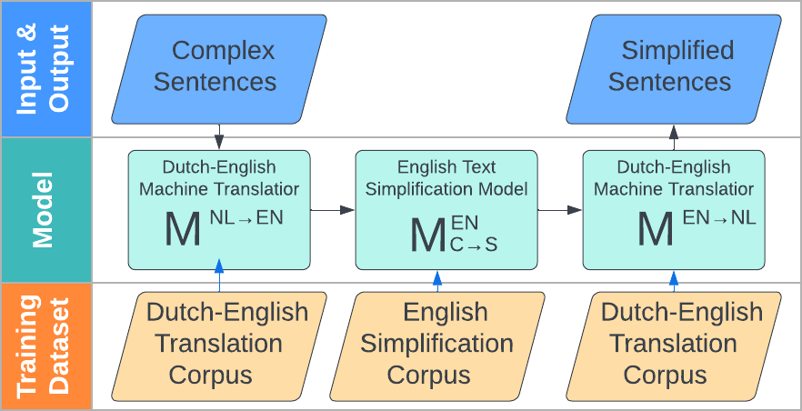

# Automatic Text Simplification for Low Resource Languages using a Pivot Approach

This repository contains the code to run a pivot-based text simplification for the Dutch medical domain and municipal domains.
The full pipeline consists of the 3 models:
* 1st model (M<sup>NL&rarr;EN</sup>): Translates complex dutch sentences to complex english sentences
* 2nd Model (M<sup>C&rarr;S</sup>): Simplifies complex english sentences to simple english sentences
* 3rd Model (M<sup>EN&rarr;NL</sup>): Translates simple english sentences to simple dutch sentences

On top of training the models, the repo contains code for evaluating the pipeline's quality using a number of automatic evaluation metrics (BLEU,SARI,METEOR).

[//]: # (![]&#40;./media/pivot_pipeline_TS.png&#41;)
<div align="center">
   
   <br>
   <em>Figure 1. Pivot pipeline for text simplification</em>
</div>

## Project Folder Structure

Explain briefly what's where so people can find their way around. For example:

There are the following folders in the structure:


1) [`scripts`](./scripts): Folder with the scripts used to perform all experiments,
including individual bash scripts for each one of the pivot-based models pipelines and
a python script for the [gpt-based experiment](./scripts/chatgpt.py).
1) [`src`](./src): Folder containing all supporting code, such as
preprocessing and filtering scripts, tokenization,
extraction of domain-specific subsets of the translation corpora, etc.
1) [`config`](./config): Folder containing configuration files for the training of the models
1) [`NMT-Data`](./NMT-Data): Folder where all data will be downloaded and models will be saved
1) [`media`](./media): Folder containing media files for demo purposes

[//]: # (1&#41; [`notebooks`]&#40;./notebooks&#41;: folder containing notebooks for running the pipeline as well as data-processing scripts for filtering, subwording, desubwording and splitting data)

## Installation
You can install this repo by following these steps:

1) Clone this repository:
    ```bash
    git clone https://github.com/Amsterdam-Internships/Text_Simplification
    ```

1) Install all dependencies:
    ```bash
    pip install -r requirements.txt
    ```
---

## Usage
The [`scripts`](./scripts) folder contains individual bash scripts for all of our experiments.
Each script is self-sufficient and covers the full setup and execution of the experiment:
- installation of requirements
- downloading corresponding data
- possibly extracting a domain-specific subsets of the translation corpora
- preprocessing, filtering and tokenization of the data
- all steps required for the training of each of the translation models (using OpenNMT)
- inference and evaluation on the test dataset

### Medical pipeline
To run the medical pipeline, the scripts expect evaluation data to be uploaded:
* Original sentences to `NMT-Data/Eval_Medical_Dutch_C_Dutch_S/NL_test_org`
* Simplified sentences to `NMT-Data/Eval_Medical_Dutch_C_Dutch_S/NL_test_simp`

The medical evaluation data has been provided by the authors of
> Evers, Marloes. Low-Resource Neural Machine Translation for Simplification of Dutch Medical Text. Diss. Tilburg University, 2021.

### Municipal pipeline
To run the municipal pipeline, the scripts expect evaluation data to be uploaded:
* Original sentences to `NMT-Data/Eval_Municipal/complex`
* Simplified sentences to `NMT-Data/Eval_Municipal/simple`

The municipal evaluation data is available on request for research purposes.

[//]: # (Please contact [Iva Gornishka]&#40;i.gornishka@amsterdam.nl&#41;.)
[//]: # (TODO: Uncomment after anonimity period.)

### In-domain data extraction
In many of our experiments we use in-domain data, extracted from the Opensubtitles corpus on the basis of similarity to a reference corpus.
To generate these in-domain data use the following script.

```commandline
    python scripts/extract_sentences.py
```

If you wish to create your own in-domain subset you can substitute the reference_file,
the output paths for the Dutch and English parts of the extracted subset,
as well as tweak other arguments such as encoding_method and num_samples.
For full documentaion, `python scripts/extract_sentences.py --help`


---
## Acknowledgements

[//]: # (This repository was created in collaboration with [Amsterdam Intelligence]&#40;https://amsterdamintelligence.com/&#41; )
[//]: # (for the [City of Amsterdam]&#40;https://www.amsterdam.nl/innovation/&#41;.)

[//]: # (We thank the [Communications Department of the City of Amsterdam]&#40;https://www.amsterdam.nl/bestuur-organisatie/organisatie/bedrijfsvoering/directie-communicatie/&#41; )
[//]: # (for providing us with a set of simplified documents which has been used for the creation of the municipal evaluation dataset.)

[//]: # (TODO: Uncomment after anonimity period)

We thank [Marloes Evers](https://www.linkedin.com/in/marloes-evers-36675b134/) for providing us with the medical evaluation dataset.

Our code uses preproccesing scripts from [MT-Preparation](https://github.com/ymoslem/MT-Preparation)